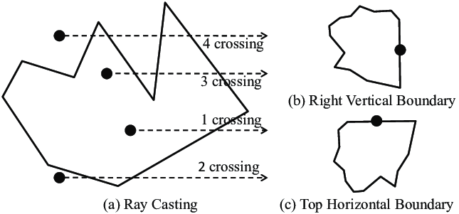

# Ray Casting Algorithm in Java
Geo tool to check if a point is inside a non-convex polygon. Also works for convex polygon.

Ray casting is a technique that discovers whether a point is inside a non-convex polygon through the number of intersections with the outside its radius has. If the number is odd, it means that the point is contained within the polygon.

